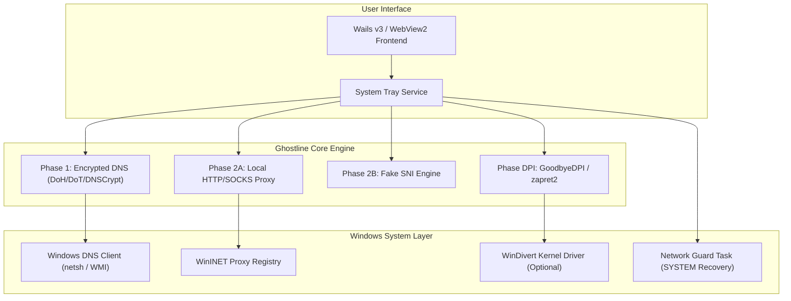

# TeamTrau Ghostline

> **TeamTrau-Ghostline** is an enhanced, high-performance, and hardened fork of Ghostline — the secure DNS and multi-protocol proxy client for Windows. Optimized with Kaizen principles for low-latency gaming (CS2, Dota 2, Steam), anti-censorship bypass, zero-allocation network relay, and system privilege hardening.

Read the full release history in [CHANGELOG.md](CHANGELOG.md).

---

## Key Enhancements & Kaizen Optimizations

### 1. Ultra-Low Latency & High Throughput (v1.0.7 - v1.0.8)
- **Native Windows 11 Multimedia Timer (1ms) (v1.0.8):** Engages `timeBeginPeriod(1)` via `winmm.dll` for ultra-precise 1ms kernel timer resolution, reducing system timer jitter and micro-stutters during competitive gaming.
- **Weighted Score Picker Algorithm (v1.0.8):** Dynamically scores upstream DNS servers based on a combined balance of latency, success rate, and RTT jitter rather than raw ping alone, ensuring optimal resolver selection under fluctuating network conditions.
- **Ultra-Fast Sequential Failover & Lock-Free Metrics (v1.0.7):** Concurrently dispatches upstream DNS queries with adaptive timeouts and lock-free atomic query statistics (`ServeStats`), preventing latency spikes under heavy concurrent lookup bursts.
- **Optimistic DNS Caching (RFC 8767):** Serves cached DNS entries instantly (~0ms) while refreshing records asynchronously in the background. Backed by a 16MB in-memory cache.
- **Dynamic DNS Benchmark & Auto-Swap:** Runs background RTT benchmarks every 10 minutes, dynamically hot-swapping upstream resolvers to the lowest latency servers without connection drops.
- **Fast Happy Eyeballs v2 (RFC 8305):** Reduced IP fallback latency from 3.0s to 250ms, eliminating connection freezes when an ISP filters or drops the primary IP.
- **TCP_NODELAY Socket Optimization:** Explicitly disabled Nagle's algorithm across proxy client/server sockets to eliminate 40–200ms ACK delays for gaming, interactive web requests, and TLS handshakes.
- **Zero-Allocation Buffer Pooling:** Integrated `sync.Pool` for 32KB relay buffers, reducing heap allocations by over 85% and preventing Garbage Collection latency spikes under heavy network load.
- **Cached Root Certificate Verifier:** Cached Windows CryptoAPI Root store parsing via `sync.Once`, saving 10–50ms CPU overhead per Fake SNI TLS handshake.

### 2. Security & Antivirus (AV) Resilience
- **DNS Interception & Middlebox Hijacking Diagnostic (v1.0.6):** Automatically detects ISP-level port 53 / UDP DNS redirection and tampering (`ERR_DNS_INTERCEPTED`), prompting safe fallback routes.
- **Local Privilege Escalation (LPE) Patch:** Hardened `guard.ps1` (which executes under `NT AUTHORITY\SYSTEM`) to verify file ownership of `state.json`. Only files authored by `SYSTEM` (`S-1-5-18`) or `BUILTIN\Administrators` (`S-1-5-32-544`) are trusted, preventing standard users or malware from hijacking system DNS.
- **Antivirus False-Positive Self-Healing:** Intercepts SmartScreen, Defender PUA, or AppLocker locks, gracefully falling back to driverless Pure DNS mode without leaving DNS stuck on loopback.
- **Service Control Manager Orphan Driver Purge:** Scans and purges lingering `WinDivert` services in preflight and on exit, eliminating driver traces left behind by ungraceful crashes.
- **Strict Network Recovery:** Failsafe DHCP restoration routines ensure loopback DNS is cleanly restored even after power cuts or hard crashes. Includes 1-click Defender exclusion script `Loai_Tru_Defender_1Click.bat`.

### 3. Dedicated Game Mode Profile & Zero-VAC Ban Architecture
- **Adaptive Polling Game Process Monitoring (v1.0.7):** Dynamic polling throttles down to save CPU when games are inactive and accelerates during game startup/exit for instantaneous profile switching.
- **Isolated Game Mode Profile:** Completely decouples gaming traffic from DPI and loopback proxies. When active, WinDivert is unloaded, system proxy is suspended so game UDP packets go direct, and low-latency registry tweaks are engaged.
- **Zero-Window Pre-flight Guard:** Inspects CS2 and Dota 2 process states *before* initiating DPI or connections. Completely eradicates the 1–2 second timing window where WinDivert previously loaded into kernel before detection, avoiding `"VAC was unable to verify your game session"` kicks.
- **Auto Game Detection & State Switching:** Passive Toolhelp monitoring of `cs2.exe`, `dota2.exe`, and `steam.exe` with immediate startup poll.
- **Valve Steam Datagram Relay (SDR) Prober:** Measures real-time latency to official Valve SDR game clusters (Singapore `sgp`, Hong Kong `hkg`, Tokyo `tyo`, Seoul `seo`).
- **Windows Gaming Network Registry Tweaks:** 1-click optimization to disable Windows network throttling (`NetworkThrottlingIndex = 0xffffffff`), maximize responsiveness (`SystemResponsiveness = 0`), and disable delayed ACKs (`TcpAckFrequency = 1`, `TCPNoDelay = 1`).
- **Complete Steam Unblock:** Cleanly bypasses ISP DNS poisoning in Vietnam for Steam Store, Community Market, and Friends network. Includes built-in `v2fly-steam` and `v2fly-twitch` community bypass presets.

### 4. Windows 11 Reliability & Tray Polish (v1.0.5 - v1.0.6)
- **Taskbar Restart & Tray Auto-Recovery (v1.0.6):** Subscribes to the Win32 `TaskbarCreated` message to recreate the system tray icon if Windows Explorer crashes or restarts, eliminating zombie background processes.
- **Deadlock-Free Tray Lifecycle (v1.0.5):** Refactored mutex lock hierarchies around minimize-to-tray, window state restoration, and exit routines to completely eliminate application freezes.

---

## Architecture Overview

---

## Usage Guide

### Portable Client
1. Download or extract the portable folder containing `ghostline.exe` and the `portable` marker file.
2. Right-click `ghostline.exe` and select **Run as administrator** (admin privilege is required to configure system DNS).
3. All configurations and temporary states are isolated inside the local `data/` directory.

### Quick Recovery Scripts
- `Khoi_Phuc_Mang_Khi_Gap_Loi.bat`: 1-click fallback to restore Windows DNS back to DHCP if the app is killed abruptly.
- `Loai_Tru_Defender_1Click.bat`: 1-click script to whitelist the application folder in Windows Defender.

### Steam & CS2 Gaming Best Practices
1. **Enable DNS Protection:** Turn on Ghostline DoH/DoT. Steam Store and Community pages load immediately.
2. **Disable DPI Bypass when Playing CS2:** Turn off DPI Bypass (GoodbyeDPI / zapret2) before competitive matches to ensure the `WinDivert` driver is not active in the kernel, preventing VAC verification kicks or FACEIT Anti-Cheat driver blocks.

---

## Acknowledgments & Credits

Special thanks and sincere appreciation to **Harry Nguyen** ([@hashcott](https://github.com/hashcott)), the original author and creator of the [Ghostline](https://github.com/hashcott/ghostline) project, for establishing its exceptional architectural foundation and visionary design.

### A Message from the Original Author

> *"Ghostline is free and always will be. If you can, please support the projects it is built on first; they do the heavy lifting:*
> - *[zapret2](https://github.com/bol-van/zapret2) by bol-van: the DPI bypass engine*
> - *[GoodbyeDPI](https://github.com/ValdikSS/GoodbyeDPI) by ValdikSS*
> - *[WinDivert](https://github.com/basil00/WinDivert) by basil00*
> - *[dnsproxy](https://github.com/AdguardTeam/dnsproxy) by AdGuard*
> - *[Wails](https://wails.io)*
>
> *Ghostline was inspired by [DNSveil / SecureDNSClient](https://github.com/msasanmh/SecureDNSClient). Third-party licenses are listed in [NOTICE](NOTICE)."*

---

## License

This project is licensed under the **GNU General Public License v3.0 (GPLv3)**.
