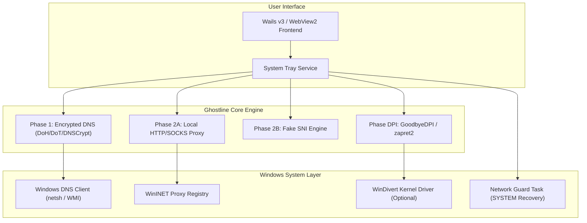

# Ghostline TeamTrau

> **Ghostline-TeamTrau** is an enhanced, high-performance, and hardened fork of Ghostline — the secure DNS and multi-protocol proxy client for Windows. Optimized with Kaizen principles for low-latency gaming (CS2, Steam), anti-censorship bypass, zero-allocation network relay, and system privilege hardening.

---

## Key Enhancements & Kaizen Optimizations

### 1. Ultra-Low Latency & High Throughput
- **Optimistic DNS Caching (RFC 8767):** Serves cached DNS entries instantly (~0ms) while refreshing records asynchronously in the background. Backed by a 16MB in-memory cache.
- **Fast Happy Eyeballs v2 (RFC 8305):** Reduced IP fallback latency from 3.0s to 250ms, eliminating annoying connection freezes when an ISP filters or drops the primary IP.
- **TCP_NODELAY Socket Optimization:** Explicitly disabled Nagle's algorithm across proxy client/server sockets to eliminate 40–200ms ACK delays for gaming, interactive web requests, and TLS handshakes.
- **Zero-Allocation Buffer Pooling:** Integrated `sync.Pool` for 32KB relay buffers, reducing heap allocations by over 85% and preventing Garbage Collection latency spikes under heavy network load.
- **Cached Root Certificate Verifier:** Cached Windows CryptoAPI Root store parsing via `sync.Once`, saving 10–50ms CPU overhead per Fake SNI TLS handshake.

### 2. Security Hardening
- **Local Privilege Escalation (LPE) Patch:** Hardened `guard.ps1` (which executes under `NT AUTHORITY\SYSTEM`) to verify file ownership of `state.json`. Only files authored by `SYSTEM` (`S-1-5-18`) or `BUILTIN\Administrators` (`S-1-5-32-544`) are trusted, preventing standard users or malware from hijacking system DNS.
- **Strict Network Recovery:** Failsafe DHCP restoration routines ensure loopback DNS is cleanly restored even after power cuts or hard crashes.

### 3. Steam & CS2 (Counter-Strike 2) Compatibility
- **Complete Steam Unblock:** Cleanly bypasses ISP DNS poisoning in Vietnam for Steam Store, Community Market, and Friends network.
- **VAC (Valve Anti-Cheat) Safe Architecture:** CS2 match traffic runs over direct UDP and remains untouched. Provides clear separation between DNS mode (100% VAC-safe) and kernel driver DPI mode.

---

## Architecture Overview

---

## Usage Guide

### Portable Client
1. Download or extract the portable folder containing `ghostline.exe` and the `portable` marker file.
2. Right-click `ghostline.exe` and select **Run as administrator** (admin privilege is required to configure system DNS).
3. All configurations and temporary states are isolated inside the local `data/` directory.

### Quick Recovery Scripts
- `Khoi_Phuc_Mang_Khi_Gap_Loi.bat`: 1-click fallback to restore Windows DNS back to DHCP if the app is killed abruptly.
- `Loai_Tru_Defender_1Click.bat`: 1-click script to whitelist the application folder in Windows Defender.

### Steam & CS2 Gaming Best Practices
1. **Enable DNS Protection:** Turn on Ghostline DoH/DoT. Steam Store and Community pages load immediately.
2. **Disable DPI Bypass when Playing CS2:** Turn off DPI Bypass (GoodbyeDPI / zapret2) before competitive matches to ensure the `WinDivert` driver is not active in the kernel, preventing VAC verification kicks or FACEIT Anti-Cheat driver blocks.

---

## Acknowledgments & Credits

Special thanks to **Harry Nguyen** ([@hashcott](https://github.com/hashcott)) for creating the original [Ghostline](https://github.com/hashcott/ghostline) project and providing its robust foundation.

---

## License

This project is licensed under the **GNU General Public License v3.0 (GPLv3)**.
