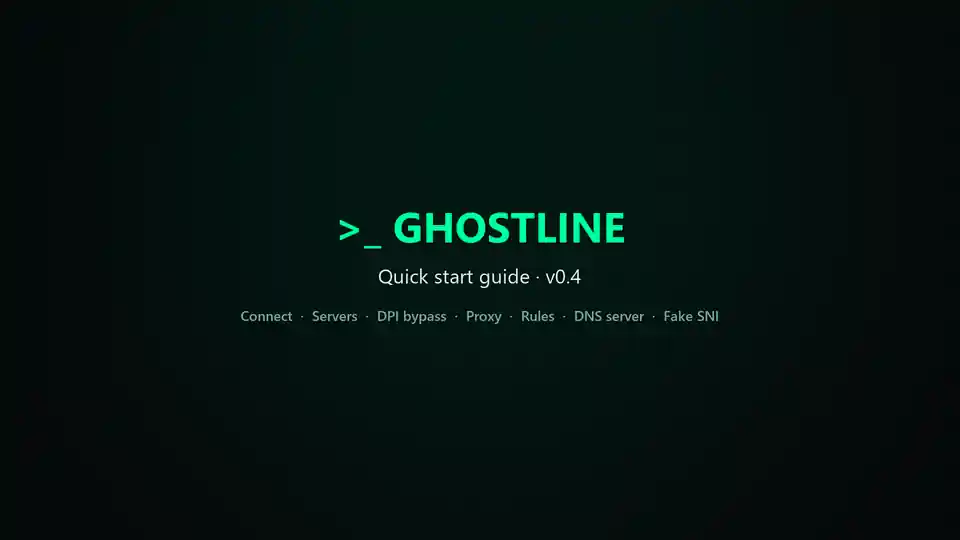

<div align="center">


# Ghostline

**One-click encrypted DNS and DPI bypass for Windows.**

[](https://github.com/hashcott/ghostline/actions/workflows/ci.yml)
[](https://github.com/hashcott/ghostline/releases)
[](https://github.com/hashcott/ghostline/releases)
[](LICENSE)


English · [Tiếng Việt](README.vi.md)

</div>

---

Ghostline runs a local DNS server on `127.0.0.1` / `::1`, points every network adapter at it, and forwards your queries over **DoH, DoT, DoQ or DNSCrypt** to the fastest healthy resolver. When your network interferes with encrypted connections by inspecting packets (DPI), it can also run a DPI bypass engine: **zapret2** (recommended) or **GoodbyeDPI**. Above all, it is built to **always give your original DNS back**, even if the app crashes or the machine loses power.

<p align="center">
  
  &nbsp;
  
</p>

## Table of contents

- [Features](#features)
- [Video](#video)
- [Screenshots](#screenshots)
- [Install](#install)
- [Usage](#usage)
- [How it works](#how-it-works)
- [Privacy](#privacy)
- [Known limitations](#known-limitations)
- [Building from source](#building-from-source)
- [Project layout](#project-layout)
- [Contributing](#contributing)
- [Security](#security)
- [Disclaimer](#disclaimer)
- [License and credits](#license-and-credits)
- [Donate](#donate)

## Features

- **Encrypted DNS for the whole system:** DoH, DoT, DoQ and DNSCrypt upstreams, powered by [AdGuard dnsproxy](https://github.com/AdguardTeam/dnsproxy).
- **Automatic server choice:** scans resolvers in parallel, rejects poisoned answers, and remembers the best servers per network.
- **Never lose the internet:** each adapter's original DNS is snapshotted before any change, with four recovery layers: clean disconnect, a watchdog process, restore on next launch, and a logon recovery task.
- **Leak verification:** after connecting, Ghostline checks that queries really go through it.
- **DPI bypass with two engines:** bundled, hash-pinned [zapret2](https://github.com/bol-van/zapret2) v1.0.5.2 (fake packets, more split methods, QUIC for YouTube/Google) and GoodbyeDPI 0.2.3rc3. zapret2 strategies come from a signed list refreshed daily, with auto-tune, a site blacklist, automatic detection of blocked sites, and DoH request fragmentation. If antivirus blocks zapret2, Ghostline falls back to GoodbyeDPI and offers to retry.
- **Local proxy (HTTP / HTTPS / SOCKS4/5):** runs with Connect, can become the Windows system proxy, and can be shared with phones and other devices on your Wi-Fi (QR code included). Names are always resolved through Ghostline's encrypted DNS.
- **Web fragmentation without a driver:** traffic through the proxy gets its TLS ClientHello split automatically when a site is blocked by SNI, and the fix is remembered per network.
- **Rules and community lists:** block, allow, fake DNS, fragment or route through an upstream proxy by domain, keyword, regexp or CIDR. Import hosts, AdBlock/AdGuard, dnsmasq, Unbound, RPZ, Clash, v2ray, sing-box or CIDR lists straight from a GitHub link, updated on a schedule.
- **DNS server for your home network:** encrypted DNS for phones, TVs, consoles and routers on your Wi-Fi: plain DNS on port 53 (no certificate needed) or DNS-over-HTTPS, with a QR-code setup page and an iOS profile.
- **Fake SNI (advanced, off by default):** for sites behind CDNs that allow domain fronting, the proxy sends a different, allowed domain name to the network. It decrypts HTTPS only for domains you choose, with a certificate that can sign only those domains and is removed on disconnect.
- **Signed server list:** updated daily and verified with ed25519; the DNSCrypt list is checked with minisign.
- **Simple and Advanced modes**, a tray icon, Vietnamese and English UI, and a neon-terminal look.
- **Installer or portable:** the portable build keeps all data in a `data\` folder next to the exe.
- **Update notifications only:** Ghostline tells you about a new version and never updates itself silently.

## Video

A 90-second walkthrough: one-click connect, scanning servers and the DPI bypass page. The preview below plays sped up; click it for the full video. A [Vietnamese version](docs/videos/guide-vi.mp4) is also available.

<p align="center">
  <a href="docs/videos/guide-en.mp4"></a>
</p>

## Screenshots

| Servers | DPI bypass |
| --- | --- |
|  |  |
| **Proxy** | **Rules and lists** |
|  |  |
| **Logs** | **Settings** |
|  |  |

## Install

Download from [Releases](https://github.com/hashcott/ghostline/releases):

| File | What it is |
| --- | --- |
| `ghostline-amd64-installer.exe` | Installer (installs WebView2 if missing) |
| `Ghostline-<version>-portable.zip` | Portable: unzip and run |
| `SHA256SUMS` | Checksums for both |

Verify the download:

```powershell
Get-FileHash .\Ghostline-0.1.0-portable.zip -Algorithm SHA256
```

**Requirements:** Windows 10/11 x64 and administrator rights. Changing adapter DNS and loading the WinDivert driver both need admin. When Ghostline starts with Windows it runs through Task Scheduler, so there is no UAC prompt.

> [!NOTE]
> Releases are not code-signed yet, so SmartScreen shows "Windows protected your PC". After checking the SHA-256, choose **More info → Run anyway**.
> Some antivirus products flag the WinDivert driver used by zapret2 and GoodbyeDPI. Ghostline verifies the engine's hash before every start; if your antivirus blocks zapret2, Ghostline runs GoodbyeDPI for now and the DPI page shows the `bin\zapret2` folder to add to the exclusions.

## Usage

> 📖 A detailed user guide covering every screen, unblocking sites and troubleshooting: **[docs/user-guide.md](docs/user-guide.md)** ([Tiếng Việt](docs/huong-dan-su-dung.md))

1. Start Ghostline and press **Connect**. It picks a server, redirects DNS and verifies there is no leak.
2. If some sites are still blocked, either turn on the **proxy** (Advanced → Proxy → enable proxy + use for this PC) so browsers get automatic fragmentation, or open **Advanced → DPI**, pick an engine (**zapret2** is recommended), turn it on and press **auto-tune**.
   To share with other devices, turn on **share on LAN** and scan the QR code on your phone (the network must be *Private*).
3. Press **Disconnect** (or quit from the tray) to restore your original DNS.

If DNS ever looks wrong, **Settings → Restore DNS now** puts every adapter back to its saved state. From a terminal you can also run:

```powershell
ghostline.exe --restore
```

## How it works

```
apps ──► Windows DNS client ──► 127.0.0.1:53 (Ghostline / dnsproxy) ──► DoH · DoT · DoQ · DNSCrypt
                                         │
            zapret2 / GoodbyeDPI (optional) rewrites outgoing TLS/HTTP/QUIC to dodge SNI filtering
```

**Safety net.** Before touching an adapter, Ghostline writes a snapshot (`state.json`) of its DNS. Four layers make sure that snapshot gets restored:

1. **Clean disconnect:** the normal path.
2. **Watchdog:** a separate `--watchdog` process restores DNS within seconds if the app dies.
3. **Next launch:** a leftover snapshot is restored at startup.
4. **Logon task:** the `Ghostline Recovery` scheduled task runs `--restore` after a crash or power loss.

Design details live in [`docs/superpowers/specs`](docs/superpowers/specs).

## Privacy

- No telemetry, no accounts, no analytics.
- Visited domains are never written to disk. The optional query log lives in RAM only.
- Network access is limited to your chosen DNS resolvers, bootstrap resolution of their hostnames, the signed server list, the DNSCrypt resolver list, the GitHub release check, and the community lists you add yourself.
- The proxy never logs destinations to disk; its live connection view is RAM-only like the query log.

## Known limitations

- If you approve UAC with a **different administrator account**, `%APPDATA%` and the system proxy belong to that account, so "use for this PC" does not affect the signed-in user.
- Web fragmentation only helps apps that go through the proxy. Apps that ignore the Windows proxy (some games, Firefox with its own proxy settings) need the DPI engine instead.
- LAN sharing works only on networks marked **Private** in Windows; Ghostline never changes the network profile itself.

- **Fake SNI** works only for browsers on this PC going through the proxy, only for domains with an `sni=` rule, and breaks apps that pin certificates. Firefox may need `security.enterprise_roots.enabled`.
- **iPhone with the DoH profile:** if this PC is off or disconnected while the iPhone is on your home Wi-Fi, turn the profile off in *Settings › VPN & Device Management*. Android's Private DNS cannot use Ghostline; set a static DNS for your Wi-Fi instead.

## Building from source

**Prerequisites:** Go 1.26+, Node.js 24, [Wails v3](https://v3.wails.io) `v3.0.0-beta.27`, and [NSIS](https://nsis.sourceforge.io) for the installer.

```bash
go install github.com/wailsapp/wails/v3/cmd/wails3@v3.0.0-beta.27

wails3 dev                     # live-reload dev build (connecting for real needs admin)
wails3 build                   # bin/ghostline.exe
wails3 package                 # NSIS installer
wails3 task windows:portable   # portable zip
```

**Tests:**

```bash
go test ./...
cd frontend && npm test
```

Integration tests change real system settings, so run them in an **admin** terminal:

```bash
go test -tags integration ./internal/sysdns/... ./internal/startup/...
```

Before a release, go through [`docs/release-checklist.md`](docs/release-checklist.md). Pushing a `v*` tag builds and publishes the release through GitHub Actions.

## Project layout

| Path | Purpose |
| --- | --- |
| `internal/app` | Orchestrator: connect, disconnect, health checks, DPI, recovery |
| `internal/engine` | Local DNS server built on dnsproxy |
| `internal/sysdns` | Read, apply and restore adapter DNS (Win32 + netsh fallback) |
| `internal/watchdog`, `internal/startup` | Watchdog process and scheduled tasks |
| `internal/dpi` | DPI engines (zapret2, GoodbyeDPI), signed strategy list, WinDivert service handling |
| `internal/scanner`, `internal/probe` | Server latency scan and blocked-site probes |
| `internal/servers`, `internal/upstreams` | Signed server list and DNSCrypt list |
| `internal/shell` | Window, tray and OS events (Wails) |
| `frontend/` | React + TypeScript UI |
| `lists/servers.json` | Signed server list, regenerated weekly by CI |

## Contributing

Bug reports, translations and pull requests are welcome. Please read [CONTRIBUTING.md](CONTRIBUTING.md) first.

## Security

Please do **not** open a public issue for vulnerabilities. See [SECURITY.md](SECURITY.md).

## Disclaimer

Ghostline is provided for research and educational purposes, to study encrypted DNS, network filtering and DPI. Its main goals are privacy (keeping DNS queries from being read or logged), protection against DNS spoofing and hijacking, and network diagnostics. You are solely responsible for how you use it and for complying with the laws and regulations of your country and the terms of your network provider. Do not use Ghostline for any unlawful purpose, including:

- reaching websites, services or content that a competent authority has ordered to be blocked under the law of your country;
- online gambling, copyright infringement, fraud, or spreading content that is prohibited by law;
- attacking, disrupting or getting unauthorized access to any network or system.

Ghostline does not ship, recommend or maintain lists of sites blocked by authorities. Lists and rules you add yourself are your own responsibility.

The software is provided "as is", without warranty of any kind. The authors are not liable for any damage, data loss, service disruption or legal consequences arising from its use. See [LICENSE](LICENSE) for the full terms.

## License and credits

Ghostline is free software, released under the [GNU General Public License v3.0 only](LICENSE). You may use, study, share and modify it; if you distribute a modified version, you must release its source code under the same license. Releases v0.1.0 and v0.1.1 were published under the MIT License.

It stands on the shoulders of [dnsproxy](https://github.com/AdguardTeam/dnsproxy), [zapret2](https://github.com/bol-van/zapret2), [GoodbyeDPI](https://github.com/ValdikSS/GoodbyeDPI), [WinDivert](https://github.com/basil00/WinDivert) and [Wails](https://wails.io), and was inspired by [DNSveil / SecureDNSClient](https://github.com/msasanmh/SecureDNSClient). Third-party licenses are listed in [NOTICE](NOTICE).

## Donate

Ghostline is free and always will be. If it helps you and you would like to support its development, you can send a tip through [PayPal](https://paypal.me/hashcott), Binance Pay, stablecoins, or by scanning the MoMo QR code with any Vietnamese banking app (VietQR / Napas 247). Thank you!

<p align="center">
  <a href="https://paypal.me/hashcott"></a>
</p>

**Binance Pay:** scan the Binance Pay QR code below with the Binance app (account `duchanhstyle`). Transfers between Binance users are free and instant.

**Stablecoins (USDT or USDC) from any other wallet:**

```
0x3C0E297cC77416DA2Ac108F09360d7Bf7C4E2c8e
```

> [!WARNING]
> Send only through **BNB Smart Chain (BEP20)** or **Arc**. Coins sent through any other network, such as Ethereum (ERC20) or Tron (TRC20), will be lost.

| Binance Pay | MoMo / VietQR |
| :---: | :---: |
|  |  |
| **USDT (BNB Smart Chain)** | **USDC (BNB Smart Chain)** |
|  |  |
