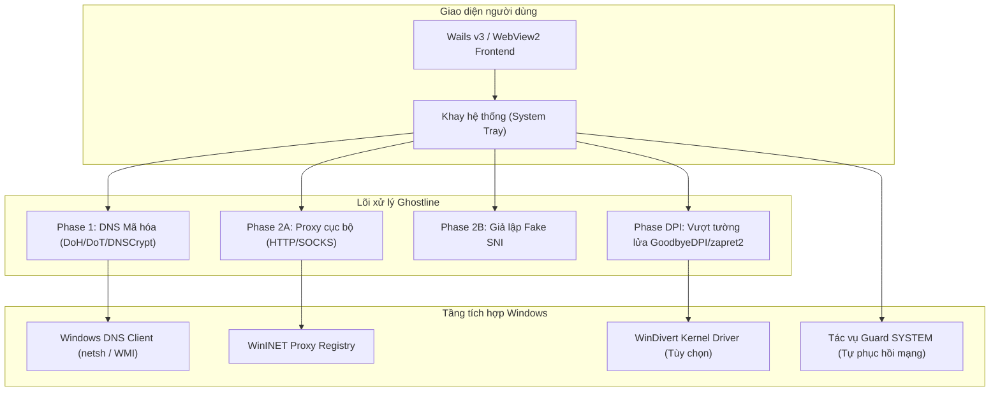

# TeamTrau Ghostline

> **TeamTrau-Ghostline** là phiên bản cải tiến, nâng cao hiệu suất và tăng cường bảo mật của Ghostline — ứng dụng máy khách DNS bảo mật và Proxy đa giao thức cho Windows. Được tinh chỉnh theo triết lý **Kaizen** nhằm giảm tối đa độ trễ cho game online (CS2, Dota 2, Steam), vượt tường lửa kiểm duyệt, chống nghẽn bộ nhớ mạng (zero-allocation) và vá các lỗ hổng leo thang đặc quyền hệ thống.

Xem chi tiết lịch sử cập nhật tại [CHANGELOG.md](CHANGELOG.md).

---

## Các cải tiến & Tối ưu hóa Kaizen nổi bật

### 1. Tốc độ cao & Triệt tiêu độ trễ mạng (v1.0.7 - v1.0.8)
- **Đồng hồ đa phương tiện độ trễ 1ms chuẩn Windows 11 (v1.0.8):** Kích hoạt `timeBeginPeriod(1)` qua `winmm.dll` khi bật Game Mode, thắt chặt độ phân giải nhịp timer kernel về mức 1ms, triệt tiêu vi giật (micro-stutter) và hạn chế biến thiên độ trễ (jitter) trong game đối kháng/bắn súng.
- **Thuật toán Weighted Score chọn Server thông minh (v1.0.8):** Chấm điểm máy chủ DNS tổng hợp dựa trên cả 3 trọng số: độ trễ (ping), tỷ lệ truy vấn thành công (success rate) và độ trôi nhịp RTT (jitter), thay vì chỉ chọn theo ping thô, giúp duy trì kết nối tối ưu khi mạng nhà mạng chập chờn.
- **Phân giải DNS song song & Thống kê Lock-Free (v1.0.7):** Cơ chế chuyển đổi dự phòng (failover) tuần tự với timeout thích ứng cùng hệ thống đếm số liệu truy vấn nguyên tử không khóa (`ServeStats`), giải tỏa triệt để nghẽn hàng đợi khi duyệt web tần suất cao.
- **Optimistic DNS Caching (RFC 8767):** Trả về bản ghi DNS đã lưu trong bộ nhớ đệm ngay tức thì (~0ms) và âm thầm cập nhật bản ghi mới trong nền. Dung lượng bộ nhớ cache mở rộng lên 16MB.
- **Tự động đo ping & đổi Upstream thông minh:** Chu kỳ 10 phút tự đo RTT các máy chủ phân giải ngầm, tự hoán đổi nóng (hot-swap) sang server có độ trễ thấp nhất mà không rò rỉ DNS hay ngắt kết nối.
- **Giảm Delay Fallback (RFC 8305 Happy Eyeballs v2):** Giảm thời gian chờ thử IP kế tiếp từ 3.0 giây xuống còn **250 mili-giây**, triệt tiêu tình trạng đứng mạng khi nhà mạng lọc hoặc bóp nghẹt IP ban đầu.
- **Tối ưu hóa Socket TCP_NODELAY:** Tắt thuật toán Nagle trên cả kết nối client và server của proxy, loại bỏ độ trễ 40–200ms ACK lag cho các gói tin mạng nhỏ, game online và bắt tay TLS.
- **Tái sử dụng bộ đệm (sync.Pool Buffer Pooling):** Tích hợp pool quản lý bộ đệm 32KB cho luồng relay dữ liệu, giảm hơn 85% cấp phát rác trên bộ nhớ Heap và ngăn chặn hiện tượng khựng/lag do Garbage Collection (GC).
- **Cache kho chứng chỉ gốc Windows:** Lưu bộ đệm phân tích Root Certificate của Windows CryptoAPI bằng `sync.Once`, tiết kiệm 10–50ms thời gian CPU cho mỗi kết nối Fake SNI.

### 2. Tăng cường bảo mật & Tự phục hồi trước Antivirus (AV Resilience)
- **Chẩn đoán phát hiện ISP chặn/cướp cổng DNS 53 (v1.0.6):** Tự động phát hiện khi nhà mạng hoặc firewall can thiệp bẻ hướng gói tin DNS (`ERR_DNS_INTERCEPTED`), thông báo lộ trình chuyển tiếp an toàn cho người dùng.
- **Vá lỗ hổng leo thang đặc quyền (LPE):** Sửa đổi script tác vụ `guard.ps1` (chạy dưới quyền tối cao `NT AUTHORITY\SYSTEM`), chỉ chấp nhận file `state.json` do `SYSTEM` (`S-1-5-18`) hoặc `BUILTIN\Administrators` (`S-1-5-32-544`) tạo ra, chặn đứng nguy cơ người dùng thường hoặc mã độc lợi dụng để đổi DNS toàn hệ thống mà không cần UAC.
- **Tự phục hồi khi bị Antivirus cách ly:** Tự phát hiện và xử lý lỗi khi file driver bị SmartScreen hoặc Defender khóa (1260, 32, 0x800704ec), tự fallback sang chế độ Pure DNS/Proxy an toàn, không làm treo DNS máy ở 127.0.0.1.
- **Dọn sạch tàn dư Service WinDivert:** Tự động quét SCM và xóa sạch service `WinDivert` còn sót lại sau sự cố crash ở bước preflight và khi thoát, ngăn chặn tình trạng VAC quét trúng driver mồ côi.
- **Tự động khôi phục mạng an toàn:** Cơ chế dự phòng đảm bảo trả lại DNS về DHCP nếu xảy ra sự cố tắt máy đột ngột. Tích hợp sẵn script 1-click loại trừ Defender `Loai_Tru_Defender_1Click.bat`.

### 3. Profile Game Mode Chuyên Biệt & Triệt Tiêu Nguy Cơ Ban VAC
- **Quét tiến trình Game thích ứng tiết kiệm CPU (v1.0.7):** Tự động giãn chu kỳ quét khi không có game chạy và tăng tốc độ quét khi phát hiện khởi chạy/tắt game để đổi trạng thái tức thì mà không tiêu tốn CPU.
- **Profile Game Mode Độc Lập:** Tách biệt hoàn toàn chế độ chơi game. Khi kích hoạt: tắt hoàn toàn DPI, gỡ driver `WinDivert` khỏi kernel, tắt System Proxy loopback để gói tin UDP game truyền thẳng, và bật tối ưu adapter.
- **Chặn nạp Driver Không Độ Trễ (Zero-Window Pre-flight Guard):** Kiểm tra tiến trình CS2/Dota 2 *trước* khi bật DPI/kết nối. Triệt tiêu hoàn toàn khoảng hở 1–2 giây driver nạp vào kernel gây lỗi *"VAC was unable to verify your game session"*.
- **Tự nhận diện Game & Tự kích hoạt Game Mode:** Quét thụ động `cs2.exe`, `dota2.exe`, và `steam.exe` bằng Toolhelp snapshot (không hook/can thiệp bộ nhớ game, an toàn tuyệt đối).
- **Đo ping cụm máy chủ Valve SDR (Steam Datagram Relay):** Tự đo độ trễ thực tế đến các cụm máy chủ Valve chính thức (Singapore `sgp`, Hong Kong `hkg`, Tokyo `tyo`, Seoul `seo`).
- **Tinh chỉnh mạng Windows tối ưu độ trễ (1-Click):** Tắt giới hạn gói tin mạng Windows (`NetworkThrottlingIndex = 0xffffffff`), dành 100% độ ưu tiên cho game (`SystemResponsiveness = 0`), gửi ACK tức thì (`TcpAckFrequency = 1`, `TCPNoDelay = 1`).
- **Mở chặn Steam 100%:** Vượt triệt để việc nhà mạng Việt Nam đầu độc DNS đối với Steam Store, Chợ cộng đồng (Community Market) và Danh sách bạn bè. Bổ sung sẵn 2 preset cộng đồng `v2fly-steam` và `v2fly-twitch`.
- **Bộ chẩn đoán mạng & ECH tích hợp:** Kiểm tra 1-click ngay trong app: Rò rỉ DNS (DNS Leak), trạng thái mã hóa Encrypted Client Hello (ECH) và đo ping TCP trực tiếp đến Steam Store, Steam Community, Discord, Cloudflare, Google DNS.

### 4. Tương thích Windows 11 & Độ ổn định khay hệ thống (v1.0.5 - v1.0.6)
- **Tự phục hồi Icon khay hệ thống khi Explorer khởi động lại (v1.0.6):** Lắng nghe thông điệp `TaskbarCreated` của Windows để tự động vẽ lại icon khay hệ thống khi Windows Explorer bị crash hoặc restart, ngăn app chạy ngầm không thể tắt.
- **Triệt tiêu nguy cơ Deadlock luồng UI (v1.0.5):** Tái cấu trúc thứ tự giải phóng Mutex khi thu nhỏ xuống khay hệ thống và đóng cửa sổ, chấm dứt hoàn toàn tình trạng app bị treo vô cớ.

---

## Kiến trúc tổng thể

---

## Hướng dẫn sử dụng

### Phiên bản Portable (Mang đi máy khác)
1. Tải về hoặc giải nén thư mục chứa `ghostline.exe` và file cờ `portable`.
2. Chuột phải vào `ghostline.exe` và chọn **Run as administrator** (cần quyền quản trị để thay đổi DNS card mạng).
3. Toàn bộ cấu hình và file tạm được cô lập hoàn toàn bên trong thư mục `data/` cạnh file chạy.

### Các công cụ hỗ trợ 1-Click đính kèm
- `Khoi_Phuc_Mang_Khi_Gap_Loi.bat`: Phục hồi DNS Windows về mặc định nếu lỡ tắt app đột ngột.
- `Loai_Tru_Defender_1Click.bat`: Tự động thêm thư mục Ghostline vào danh sách loại trừ của Windows Defender.

### Quy tắc an toàn khi chơi CS2 / Game qua Steam
1. **Bật bảo vệ DNS:** Bật Ghostline với chế độ DoH/DoT. Trang chủ Steam, Chợ và Đăng nhập tự động mở 100%.
2. **TẮT Vượt DPI khi vào bắn CS2:** Tắt tính năng DPI Bypass (GoodbyeDPI / zapret2) trước khi vào trận đấu CS2 để gỡ driver `WinDivert` khỏi Kernel, tránh bị lỗi ngắt kết nối *"VAC was unable to verify your game session"* hoặc bị FACEIT Anti-Cheat chặn.

---

## Lời cảm ơn (Acknowledgments & Credits)

Trân trọng gửi lời cảm ơn sâu sắc tới **Harry Nguyen** ([@hashcott](https://github.com/hashcott)) — tác giả gốc của dự án [Ghostline](https://github.com/hashcott/ghostline) — đã đặt nền móng kiến trúc xuất sắc và tầm nhìn phát triển ban đầu cho dự án.

### Lời cảm ơn và chia sẻ từ tác giả gốc

> *"Ghostline miễn phí và sẽ luôn miễn phí. Nếu có thể, bạn hãy ưu tiên ủng hộ các dự án mà Ghostline dựa vào, vì phần việc khó nhất là của họ:*
> - *[zapret2](https://github.com/bol-van/zapret2) của bol-van: engine vượt DPI*
> - *[GoodbyeDPI](https://github.com/ValdikSS/GoodbyeDPI) của ValdikSS*
> - *[WinDivert](https://github.com/basil00/WinDivert) của basil00*
> - *[dnsproxy](https://github.com/AdguardTeam/dnsproxy) của AdGuard*
> - *[Wails](https://wails.io)*
>
> *Dự án lấy cảm hứng từ [DNSveil / SecureDNSClient](https://github.com/msasanmh/SecureDNSClient). Giấy phép của các bên thứ ba được liệt kê chi tiết trong [NOTICE](NOTICE)."*

---

## Giấy phép (License)

Dự án phát hành theo giấy phép **GNU General Public License v3.0 (GPLv3)**.
