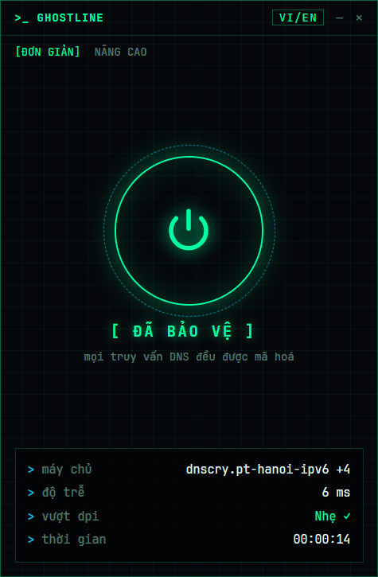
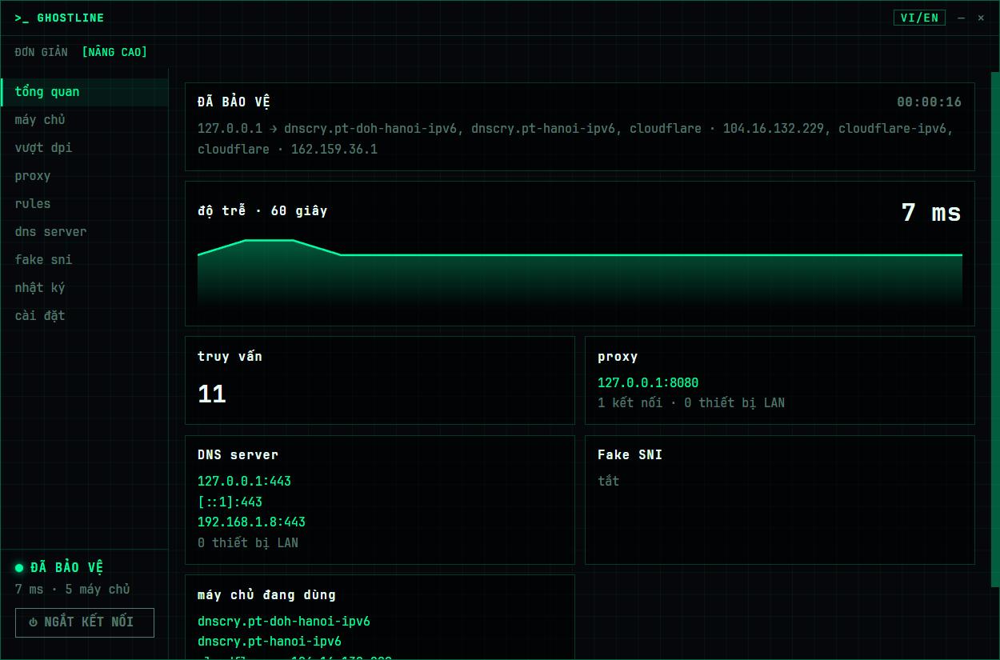
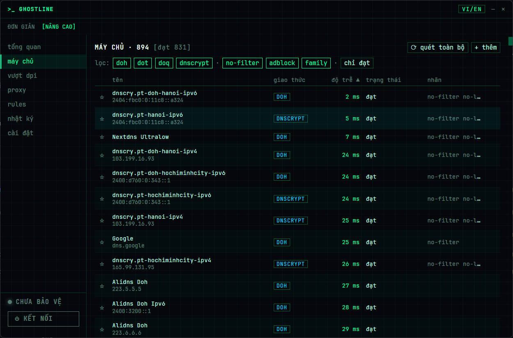
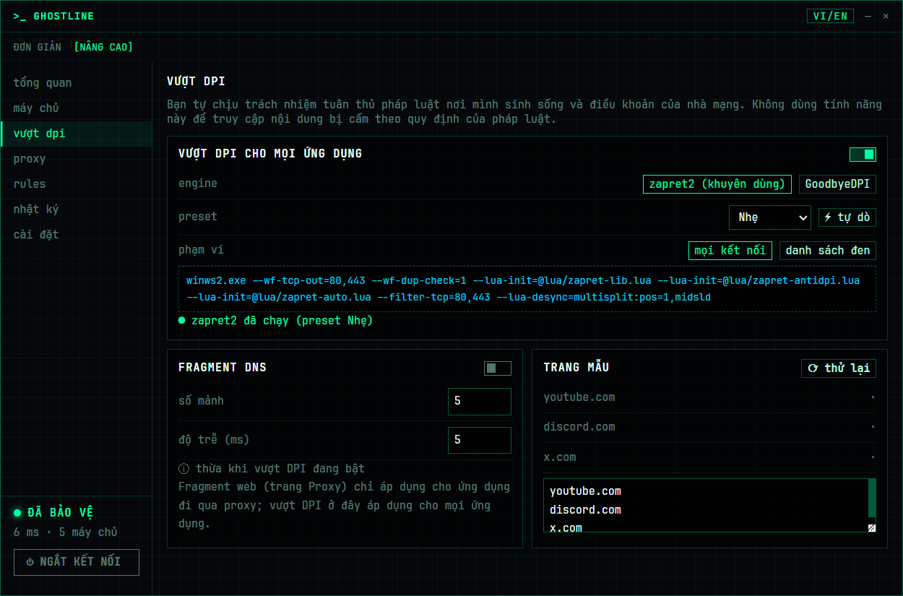
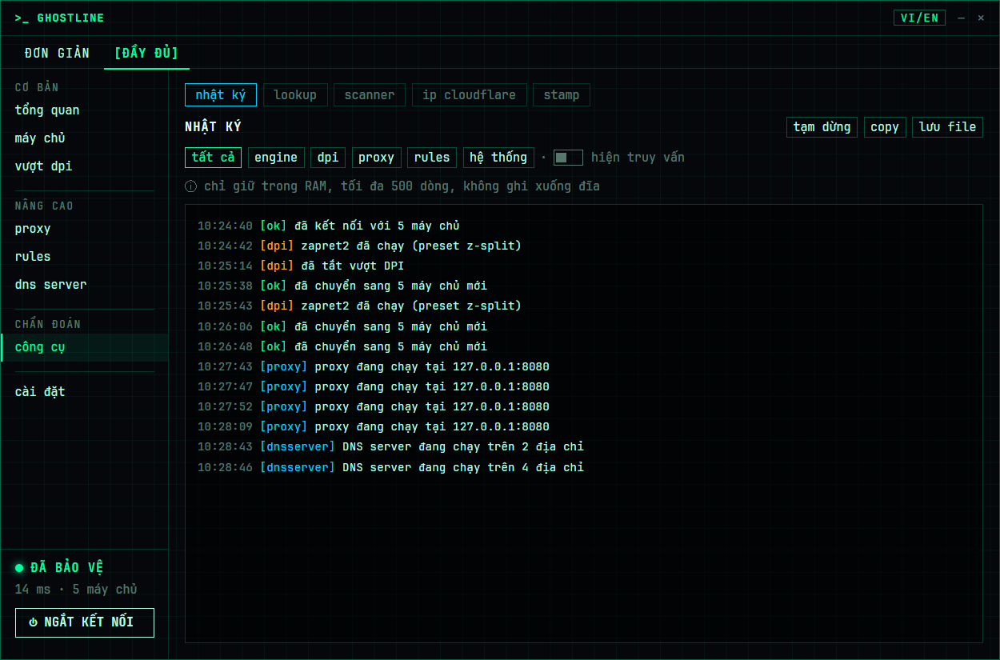
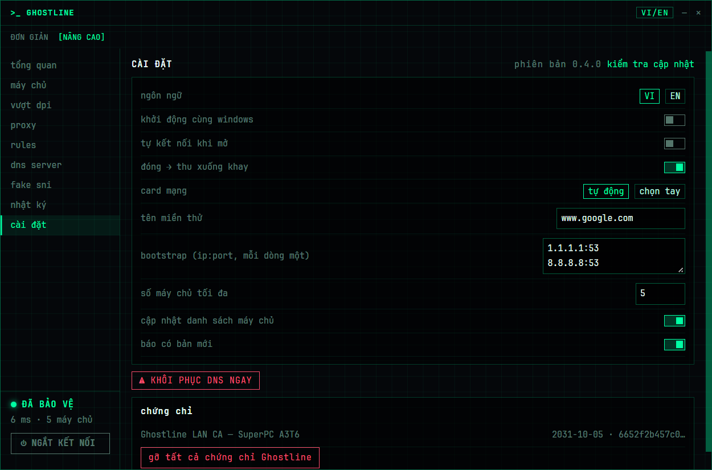

<div align="center">


# Ghostline

**Mã hoá DNS và vượt DPI cho Windows, chỉ với một nút bấm.**

[](https://github.com/hashcott/ghostline/actions/workflows/ci.yml)
[](https://github.com/hashcott/ghostline/releases)
[](LICENSE)


[English](README.md) · Tiếng Việt

</div>

---

Ghostline chạy một DNS server cục bộ trên `127.0.0.1` / `::1`, trỏ mọi card mạng về đó, rồi chuyển tiếp truy vấn qua **DoH, DoT, DoQ hoặc DNSCrypt** tới máy chủ nhanh nhất còn hoạt động. Khi nhà mạng chặn trang web theo SNI, Ghostline có thể chạy thêm **GoodbyeDPI**. Trên hết, Ghostline được thiết kế để **luôn trả lại DNS gốc của bạn**, kể cả khi app bị tắt đột ngột hay máy mất điện.

<p align="center">
  
  &nbsp;
  
</p>

## Mục lục

- [Tính năng](#tính-năng)
- [Ảnh chụp màn hình](#ảnh-chụp-màn-hình)
- [Cài đặt](#cài-đặt)
- [Sử dụng](#sử-dụng)
- [Cách hoạt động](#cách-hoạt-động)
- [Quyền riêng tư](#quyền-riêng-tư)
- [Build từ mã nguồn](#build-từ-mã-nguồn)
- [Đóng góp](#đóng-góp)
- [Bảo mật](#bảo-mật)
- [Giấy phép và ghi công](#giấy-phép-và-ghi-công)

## Tính năng

- **Mã hoá DNS cho toàn hệ thống:** hỗ trợ DoH, DoT, DoQ, DNSCrypt, chạy trên [AdGuard dnsproxy](https://github.com/AdguardTeam/dnsproxy).
- **Tự chọn máy chủ:** quét song song, loại máy chủ trả kết quả bị đầu độc, và nhớ máy chủ tốt nhất cho từng mạng.
- **Không bao giờ mất mạng:** chụp lại DNS gốc của từng card mạng trước khi đổi, với 4 lớp khôi phục: ngắt kết nối sạch, tiến trình watchdog, khôi phục khi mở lại app, và tác vụ chạy lúc đăng nhập.
- **Xác minh không rò rỉ:** sau khi kết nối, Ghostline kiểm tra truy vấn thật sự đi qua nó.
- **Vượt DPI:** đi kèm GoodbyeDPI 0.2.2 (được khoá mã băm), có preset, tự dò, danh sách đen, và chia nhỏ (fragment) truy vấn DoH.
- **Danh sách máy chủ có chữ ký:** cập nhật mỗi ngày, xác minh bằng ed25519; danh sách DNSCrypt được kiểm tra bằng minisign.
- **Chế độ Đơn giản và Nâng cao**, icon khay, giao diện tiếng Việt và tiếng Anh, phong cách neon-terminal.
- **Bản cài đặt hoặc portable:** bản portable lưu mọi dữ liệu trong thư mục `data\` cạnh file exe.
- **Chỉ thông báo khi có bản mới:** không bao giờ tự cập nhật ngầm.

## Ảnh chụp màn hình

| Máy chủ | Vượt DPI |
| --- | --- |
|  |  |
| **Nhật ký** | **Cài đặt** |
|  |  |

## Cài đặt

Tải từ trang [Releases](https://github.com/hashcott/ghostline/releases):

| File | Là gì |
| --- | --- |
| `ghostline-amd64-installer.exe` | Bản cài đặt (tự cài WebView2 nếu thiếu) |
| `Ghostline-<phiên bản>-portable.zip` | Bản portable: giải nén rồi chạy |
| `SHA256SUMS` | Mã SHA-256 của hai file trên |

Kiểm tra file đã tải:

```powershell
Get-FileHash .\Ghostline-0.1.0-portable.zip -Algorithm SHA256
```

**Yêu cầu:** Windows 10/11 x64 và quyền quản trị (admin), vì đổi DNS của card mạng và nạp driver WinDivert đều cần quyền này. Khi khởi động cùng Windows, Ghostline chạy qua Task Scheduler nên không hiện hộp thoại UAC.

> [!NOTE]
> Bản phát hành chưa được ký số, nên SmartScreen sẽ hiện "Windows protected your PC". Sau khi đã kiểm tra SHA-256, chọn **More info → Run anyway**.
> Một số phần mềm diệt virus báo nhầm driver WinDivert mà GoodbyeDPI dùng. Ghostline kiểm tra mã băm của GoodbyeDPI trước mỗi lần chạy; nếu bị chặn, hãy thêm thư mục Ghostline vào danh sách loại trừ.
>
> Nếu bạn nâng quyền UAC bằng **một tài khoản admin khác**, dữ liệu của Ghostline sẽ nằm trong `%APPDATA%` của tài khoản admin đó.

## Sử dụng

> 📖 Hướng dẫn chi tiết từng màn hình, cách vượt chặn và xử lý sự cố: **[docs/huong-dan-su-dung.md](docs/huong-dan-su-dung.md)**

1. Mở Ghostline và bấm **Kết nối**. App tự chọn máy chủ, chuyển hướng DNS và kiểm tra rò rỉ.
2. Nếu vẫn còn trang bị chặn, vào **Nâng cao → DPI**, bật **GoodbyeDPI**, hoặc bấm **tự dò** để tìm preset hợp với mạng của bạn.
3. Bấm **Ngắt kết nối** (hoặc thoát từ icon khay) để trả lại DNS gốc.

Nếu DNS có vẻ không đúng, vào **Cài đặt → Khôi phục DNS ngay** để đưa mọi card mạng về trạng thái đã lưu. Bạn cũng có thể chạy lệnh:

```powershell
ghostline.exe --restore
```

## Cách hoạt động

```
ứng dụng ──► DNS client của Windows ──► 127.0.0.1:53 (Ghostline / dnsproxy) ──► DoH · DoT · DoQ · DNSCrypt
                                                │
                       GoodbyeDPI (tuỳ chọn) biến đổi gói TLS/HTTP đi ra để né lọc SNI
```

**Lưới an toàn.** Trước khi đổi DNS của một card mạng, Ghostline ghi lại DNS hiện tại của card đó vào `state.json`. Bốn lớp sau bảo đảm bản lưu này luôn được khôi phục:

1. **Ngắt kết nối sạch:** trường hợp thông thường.
2. **Watchdog:** một tiến trình `--watchdog` riêng khôi phục DNS trong vài giây nếu app chết.
3. **Lần mở sau:** nếu còn bản lưu sót lại, app khôi phục ngay khi khởi động.
4. **Tác vụ đăng nhập:** tác vụ `Ghostline Recovery` chạy `--restore` sau khi máy treo hoặc mất điện.

Chi tiết thiết kế nằm trong [`docs/superpowers/specs`](docs/superpowers/specs).

## Quyền riêng tư

- Không telemetry, không tài khoản, không thống kê.
- Không bao giờ ghi tên miền bạn truy cập xuống đĩa. Nhật ký truy vấn (nếu bật) chỉ nằm trong RAM.
- App chỉ kết nối mạng tới: máy chủ DNS bạn chọn, DNS bootstrap để phân giải tên các máy chủ đó, danh sách máy chủ có chữ ký, danh sách DNSCrypt, và GitHub để kiểm tra bản mới.

## Build từ mã nguồn

**Cần có:** Go 1.26+, Node.js 24, [Wails v3](https://v3.wails.io) `v3.0.0-beta.27`, và [NSIS](https://nsis.sourceforge.io) để tạo bản cài đặt.

```bash
go install github.com/wailsapp/wails/v3/cmd/wails3@v3.0.0-beta.27

wails3 dev                     # chạy thử với tự tải lại (kết nối thật cần admin)
wails3 build                   # bin/ghostline.exe
wails3 package                 # bản cài đặt NSIS
wails3 task windows:portable   # file zip portable
```

**Test:**

```bash
go test ./...
cd frontend && npm test
```

Test tích hợp thay đổi cài đặt thật của hệ thống, nên cần chạy trong terminal **admin**:

```bash
go test -tags integration ./internal/sysdns/... ./internal/startup/...
```

Trước khi phát hành, đi qua [`docs/release-checklist.md`](docs/release-checklist.md). Đẩy một tag `v*` lên GitHub sẽ tự build và tạo trang Release qua GitHub Actions. Quy trình phát hành chi tiết: [`docs/releasing.md`](docs/releasing.md).

### Danh sách máy chủ có chữ ký

`lists/servers.json` được workflow **servers** sinh lại và ký (ed25519) mỗi tuần, hoặc khi bấm chạy tay, bằng secret `SERVERLIST_SIGNING_KEY`, rồi commit lên `main`. App tải file này mỗi ngày. Workflow **release** không sinh lại danh sách: bản phát hành nhúng đúng file đang có trong repo lúc gắn tag.

## Đóng góp

Báo lỗi, dịch thuật và pull request đều được hoan nghênh. Vui lòng đọc [CONTRIBUTING.md](CONTRIBUTING.md) trước.

## Bảo mật

Vui lòng **không** báo lỗ hổng bảo mật qua issue công khai. Xem [SECURITY.md](SECURITY.md).

## Giấy phép và ghi công

Ghostline phát hành theo [giấy phép MIT](LICENSE).

Dự án được xây dựng trên [dnsproxy](https://github.com/AdguardTeam/dnsproxy), [GoodbyeDPI](https://github.com/ValdikSS/GoodbyeDPI), [WinDivert](https://github.com/basil00/WinDivert) và [Wails](https://wails.io), và lấy cảm hứng từ [DNSveil / SecureDNSClient](https://github.com/msasanmh/SecureDNSClient). Giấy phép của các thành phần bên thứ ba được liệt kê trong [NOTICE](NOTICE).
