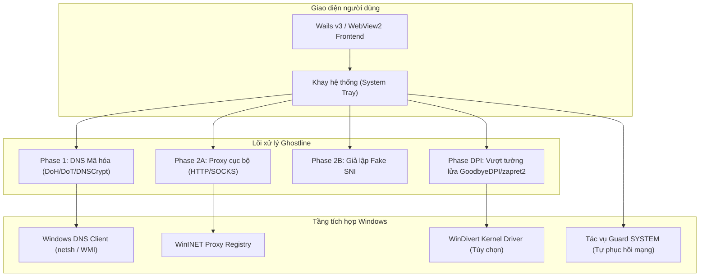

# TeamTrau Ghostline

> **TeamTrau-Ghostline** là phiên bản cải tiến, nâng cao hiệu suất và tăng cường bảo mật của Ghostline — ứng dụng máy khách DNS bảo mật và Proxy đa giao thức cho Windows. Được tinh chỉnh theo triết lý **Kaizen** nhằm giảm tối đa độ trễ cho game online (CS2, Dota 2, Steam), vượt tường lửa kiểm duyệt, chống nghẽn bộ nhớ mạng (zero-allocation) và vá các lỗ hổng leo thang đặc quyền hệ thống.

Xem chi tiết lịch sử cập nhật tại [CHANGELOG.md](CHANGELOG.md).

---

## Các cải tiến & Tối ưu hóa Kaizen nổi bật

### 1. Tốc độ cao & Triệt tiêu độ trễ mạng (Low Latency)
- **Optimistic DNS Caching (RFC 8767):** Trả về bản ghi DNS đã lưu trong bộ nhớ đệm ngay tức thì (~0ms) và âm thầm cập nhật bản ghi mới trong nền. Dung lượng bộ nhớ cache mở rộng lên 16MB.
- **Tự động đo ping & đổi Upstream thông minh (v1.0.2):** Chu kỳ 10 phút tự đo RTT các máy chủ phân giải ngầm, tự hoán đổi nóng (hot-swap) sang server có độ trễ thấp nhất mà không rò rỉ DNS hay ngắt kết nối.
- **Giảm Delay Fallback (RFC 8305 Happy Eyeballs v2):** Giảm thời gian chờ thử IP kế tiếp từ 3.0 giây xuống còn **250 mili-giây**, triệt tiêu tình trạng đứng mạng khi nhà mạng lọc hoặc bóp nghẹt IP ban đầu.
- **Tối ưu hóa Socket TCP_NODELAY:** Tắt thuật toán Nagle trên cả kết nối client và server của proxy, loại bỏ độ trễ 40–200ms ACK lag cho các gói tin mạng nhỏ, game online và bắt tay TLS.
- **Tái sử dụng bộ đệm (sync.Pool Buffer Pooling):** Tích hợp pool quản lý bộ đệm 32KB cho luồng relay dữ liệu, giảm hơn 85% cấp phát rác trên bộ nhớ Heap và ngăn chặn hiện tượng khựng/lag do Garbage Collection (GC).
- **Cache kho chứng chỉ gốc Windows:** Lưu bộ đệm phân tích Root Certificate của Windows CryptoAPI bằng `sync.Once`, tiết kiệm 10–50ms thời gian CPU cho mỗi kết nối Fake SNI.

### 2. Tăng cường bảo mật & Tự phục hồi trước Antivirus (AV Resilience)
- **Vá lỗ hổng leo thang đặc quyền (LPE):** Sửa đổi script tác vụ `guard.ps1` (chạy dưới quyền tối cao `NT AUTHORITY\SYSTEM`), chỉ chấp nhận file `state.json` do `SYSTEM` (`S-1-5-18`) hoặc `BUILTIN\Administrators` (`S-1-5-32-544`) tạo ra, chặn đứng nguy cơ người dùng thường hoặc mã độc lợi dụng để đổi DNS toàn hệ thống mà không cần UAC.
- **Tự phục hồi khi bị Antivirus cách ly (v1.0.2):** Tự phát hiện và xử lý lỗi khi file driver bị SmartScreen hoặc Defender khóa (1260, 32, 0x800704ec), tự fallback sang chế độ Pure DNS/Proxy an toàn, không làm treo DNS máy ở 127.0.0.1.
- **Tự động khôi phục mạng an toàn:** Cơ chế dự phòng đảm bảo trả lại DNS về DHCP nếu xảy ra sự cố tắt máy đột ngột. Tích hợp sẵn script 1-click loại trừ Defender `Loai_Tru_Defender_1Click.bat`.

### 3. Tương thích chuyên sâu CS2, Dota 2 & Steam (v1.0.3)
- **Tự nhận diện Game & Bảo vệ VAC (v1.0.3):** Quét thụ động tiến trình `cs2.exe`, `dota2.exe`, và `steam.exe` bằng Windows Toolhelp snapshot (không chạm vào bộ nhớ game, an toàn 100%).
- **Tự động ngắt driver WinDivert chống VAC kick:** Khi CS2 hoặc Dota 2 bật, Ghostline tự động dỡ bỏ driver `WinDivert` khỏi kernel (`PauseDPIForGame`), triệt tiêu 100% lỗi *"VAC was unable to verify your game session"* và tránh bị FACEIT Anti-Cheat chặn. Tự động bật lại khi game tắt.
- **Đo ping cụm máy chủ Valve SDR (Steam Datagram Relay):** Tự đo độ trễ thực tế đến các cụm máy chủ Valve chính thức (Singapore `sgp`, Hong Kong `hkg`, Tokyo `tyo`, Seoul `seo`).
- **Tinh chỉnh mạng Windows tối ưu độ trễ (1-Click):** Tắt giới hạn gói tin mạng Windows (`NetworkThrottlingIndex = 0xffffffff`), dành 100% độ ưu tiên cho game (`SystemResponsiveness = 0`), gửi ACK tức thì (`TcpAckFrequency = 1`, `TCPNoDelay = 1`).
- **Mở chặn Steam 100%:** Vượt triệt để việc nhà mạng Việt Nam đầu độc DNS đối với Steam Store, Chợ cộng đồng (Community Market) và Danh sách bạn bè. Bổ sung sẵn 2 preset cộng đồng `v2fly-steam` và `v2fly-twitch`.
- **Bộ chẩn đoán mạng & ECH tích hợp (v1.0.2):** Kiểm tra 1-click ngay trong app: Rò rỉ DNS (DNS Leak), trạng thái mã hóa Encrypted Client Hello (ECH) và đo ping TCP trực tiếp đến Steam Store, Steam Community, Discord, Cloudflare, Google DNS.

---

## Kiến trúc tổng thể

---

## Hướng dẫn sử dụng

### Phiên bản Portable (Mang đi máy khác)
1. Tải về hoặc giải nén thư mục chứa `ghostline.exe` và file cờ `portable`.
2. Chuột phải vào `ghostline.exe` và chọn **Run as administrator** (cần quyền quản trị để thay đổi DNS card mạng).
3. Toàn bộ cấu hình và file tạm được cô lập hoàn toàn bên trong thư mục `data/` cạnh file chạy.

### Các công cụ hỗ trợ 1-Click đính kèm
- `Khoi_Phuc_Mang_Khi_Gap_Loi.bat`: Phục hồi DNS Windows về mặc định nếu lỡ tắt app đột ngột.
- `Loai_Tru_Defender_1Click.bat`: Tự động thêm thư mục Ghostline vào danh sách loại trừ của Windows Defender.

### Quy tắc an toàn khi chơi CS2 / Game qua Steam
1. **Bật bảo vệ DNS:** Bật Ghostline với chế độ DoH/DoT. Trang chủ Steam, Chợ và Đăng nhập tự động mở 100%.
2. **TẮT Vượt DPI khi vào bắn CS2:** Tắt tính năng DPI Bypass (GoodbyeDPI / zapret2) trước khi vào trận đấu CS2 để gỡ driver `WinDivert` khỏi Kernel, tránh bị lỗi ngắt kết nối *"VAC was unable to verify your game session"* hoặc bị FACEIT Anti-Cheat chặn.

---

## Lời cảm ơn (Acknowledgments & Credits)

Chân thành cảm ơn tác giả **Harry Nguyen** ([@hashcott](https://github.com/hashcott)) đã phát triển dự án gốc [Ghostline](https://github.com/hashcott/ghostline) và xây dựng nền tảng kiến trúc vững chắc ban đầu.

---

## Giấy phép (License)

Dự án phát hành theo giấy phép **GNU General Public License v3.0 (GPLv3)**.
