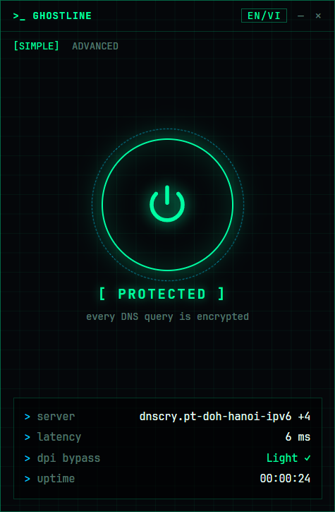
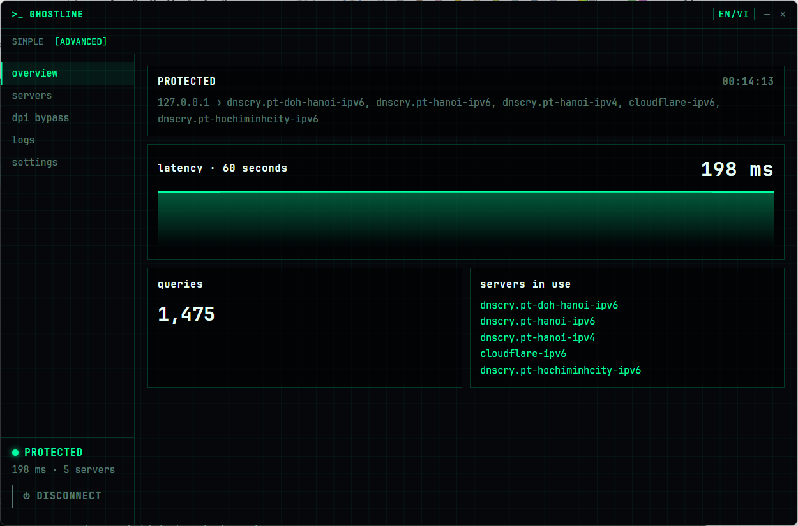
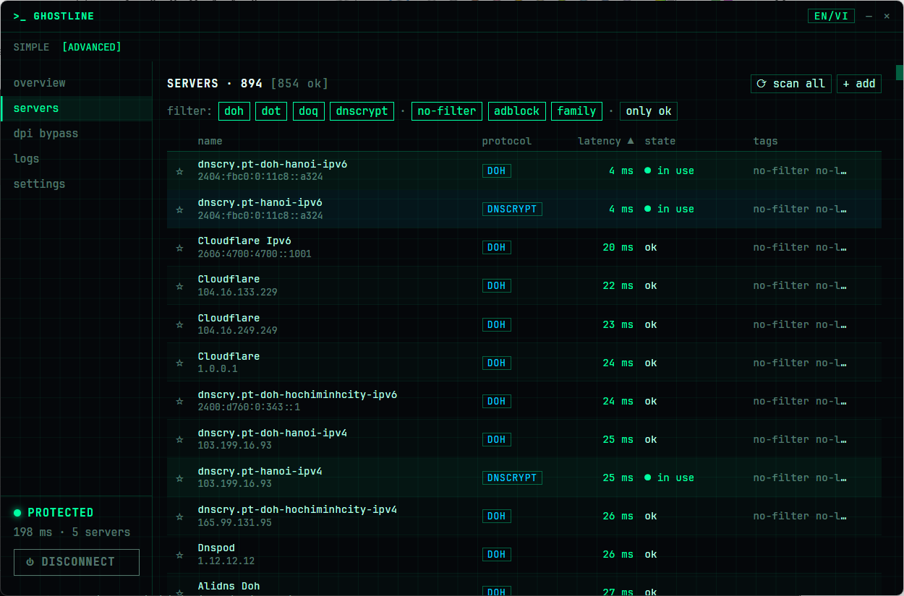
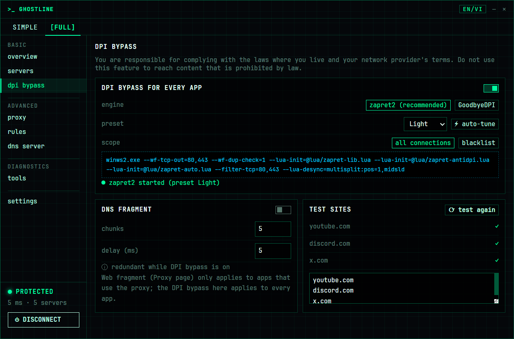
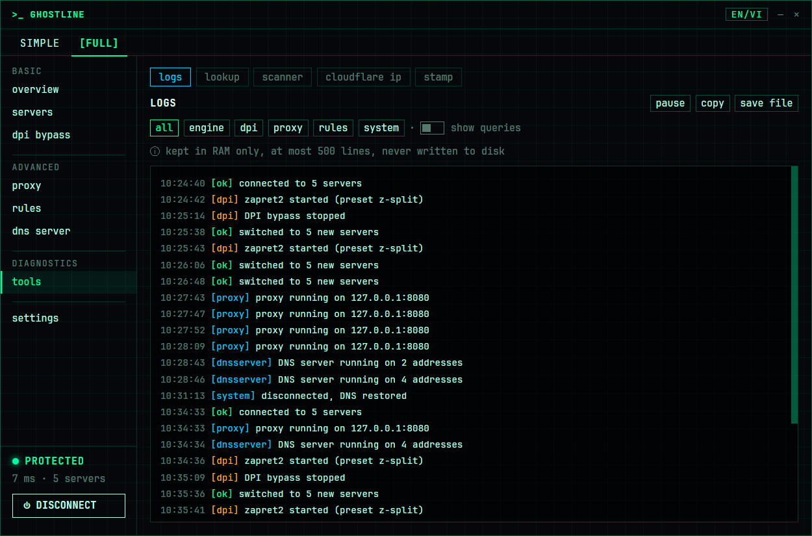
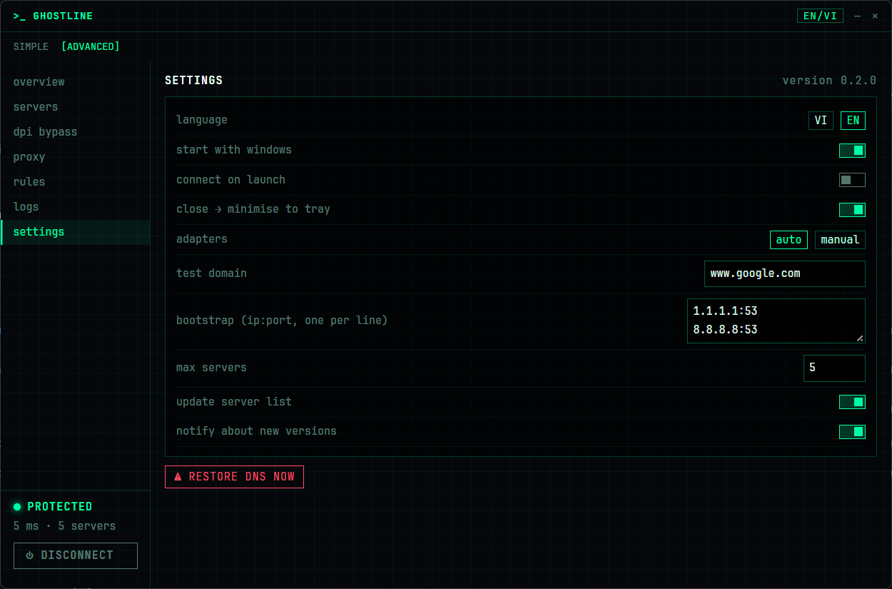
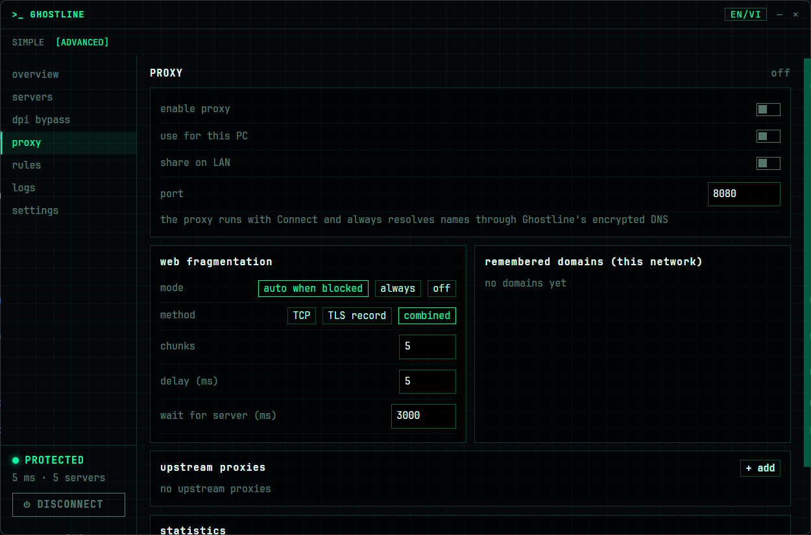
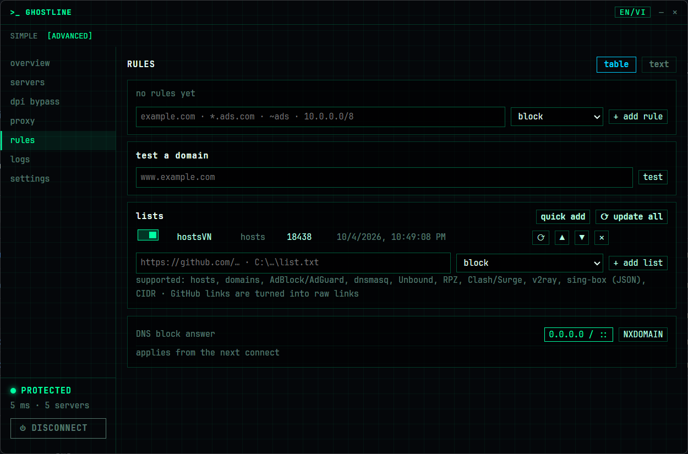

# Ghostline user guide

This guide is for anyone running Windows 10/11; no technical background is needed. Sections 1–3 are enough to get started. The rest covers fine-tuning and troubleshooting.

[Tiếng Việt](huong-dan-su-dung.md)

## Contents

1. [What Ghostline does](#1-what-ghostline-does)
2. [Installing](#2-installing)
3. [Quick start: one button](#3-quick-start-one-button)
4. [Advanced mode](#4-advanced-mode)
   - [Overview](#41-overview)
   - [Servers](#42-servers)
   - [DPI bypass](#43-dpi-bypass)
   - [Logs](#44-logs)
   - [Settings](#45-settings)
   - [Proxy](#46-proxy)
   - [Rules and lists](#47-rules-and-lists)
   - [DNS server](#48-dns-server)
   - [Fake SNI](#49-fake-sni)
5. [The tray icon](#5-the-tray-icon)
6. [When a site is still blocked](#6-when-a-site-is-still-blocked)
7. [Troubleshooting](#7-troubleshooting)
8. [Uninstalling](#8-uninstalling)
9. [FAQ](#9-faq)

---

## 1. What Ghostline does

Every time you open a website, your computer asks **DNS**: "what is the IP address of this site?" Normally that question travels **unencrypted**, so your ISP can read it, log it, or answer with a wrong address to block the site.

Ghostline runs a small DNS server on your own machine (`127.0.0.1`), points every network adapter at it, and sends your DNS questions over an **encrypted** channel (DoH, DoT, DoQ or DNSCrypt) to the fastest server available. If your ISP also blocks sites by inspecting packets (DPI), Ghostline can run a DPI bypass engine (**zapret2** or **GoodbyeDPI**) to get around it.

Most importantly, **Ghostline always gives your original DNS back** when you disconnect, even if the app crashes or the machine loses power.

## 2. Installing

Download from [Releases](https://github.com/hashcott/ghostline/releases). There are two options:

| Build | When to use it |
| --- | --- |
| `ghostline-amd64-installer.exe` | For everyday use on your own PC. Adds a Start Menu shortcut and can be removed from Settings → Apps. |
| `Ghostline-<version>-portable.zip` | When you don't want to install anything, or to run from a USB drive. Unzip it into a folder and run `ghostline.exe`. All data stays in the `data\` folder next to it. |

**Verify the download (recommended).** Open PowerShell in the folder with the downloaded file:

```powershell
Get-FileHash .\ghostline-amd64-installer.exe -Algorithm SHA256
```

Compare the result with the matching line in `SHA256SUMS` on the Releases page. If they differ, **do not run the file**.

**SmartScreen warning.** Releases are not code-signed yet, so Windows shows "Windows protected your PC". After checking the SHA-256, click **More info → Run anyway**.

**Administrator rights.** Ghostline needs admin rights to change DNS and run GoodbyeDPI, so Windows shows a UAC prompt each time you open it. Choose **Yes**. If you turn on *start with windows*, the app is launched through Task Scheduler and no longer asks.

**Antivirus.** zapret2 and GoodbyeDPI use the **WinDivert** driver, which antivirus products often flag by mistake. Ghostline checks the engine's hash before every start. If zapret2 is blocked, Ghostline runs GoodbyeDPI for now and the DPI page shows the `bin\zapret2` folder to add to Windows Defender's exclusions.

## 3. Quick start: one button

<p align="center"></p>

Ghostline opens in **SIMPLE** mode.

1. Click the **round power button** in the middle.
2. Ghostline goes through: checking the system → choosing servers → starting the engine → saving original DNS → arming safety net → setting DNS → verifying no leaks. The first time takes about 10–25 seconds because it scans servers; after that it takes a few seconds.
3. When the ring glows green and shows **[ PROTECTED ]**, you're done: every DNS query on the machine is encrypted.

To cancel while connecting, click the power button again. To turn protection off, click the power button while protected; your DNS goes back to what it was.

**The info panel below:**

| Row | Meaning |
| --- | --- |
| server | The DNS server in use; `+4` means four more servers run alongside it as backup |
| latency | Average time to get a DNS answer |
| dpi bypass | The GoodbyeDPI preset in use, or *off* |
| uptime | How long you've been protected |

**Statuses you may see:**

| Status | Meaning |
| --- | --- |
| UNPROTECTED | Your machine is using its original DNS |
| CONNECTING | Running the steps above |
| PROTECTED | Everything is working |
| DEGRADED | Servers are slow or not answering; Ghostline is finding new ones by itself. Browsing still works |
| ERROR | Connecting failed. **Your DNS was not changed.** Read the message below it for what to do (see [section 7](#7-troubleshooting)) |

## 4. Advanced mode

Click **ADVANCED** at the top left for the full interface, and **SIMPLE** to go back. The left sidebar always shows the current status and a **⏻ CONNECT / DISCONNECT** button.

### 4.1. Overview



- **Top panel:** status, uptime, and the DNS route: `127.0.0.1 → the servers in use`.
- **latency · 60 seconds:** a latency chart for the last minute. Lower is better.
- **queries:** the number of DNS queries answered since you connected.
- **servers in use:** the servers Ghostline queries in parallel; the fastest answer wins.

### 4.2. Servers



Every encrypted DNS server Ghostline knows about (several hundred), refreshed daily from a signed list.

- **⟳ scan all:** re-measures every server's latency and drops servers that return wrong (poisoned) answers. Ghostline scans by itself when needed; click it after switching networks or when things feel slow.
- **filter:** pick protocols (`doh`, `dot`, `doq`, `dnscrypt`) or server types:
  - `no-filter`: blocks nothing.
  - `adblock`: blocks ads and trackers.
  - `family`: blocks adult content, good for children's computers.
  - **only ok:** show only servers that are currently working.
- **Click a column header** (name, latency…) to sort.
- **☆ Pin:** click the star (or double-click the row) to pin servers you like. Right-click a row for more: use only this server, check again, copy address/IP, remove. Pinned servers stay at the top of the table and are **preferred when connecting**: every pinned server that passes the check is used first, and the remaining slots go to the fastest others. Turn on **use pinned servers only** (next to the search box) to use nothing else.
- **Search and bulk pin:** type in the search box (name, provider, protocol, address, IP or tag; several words must all match), then **★ pin all results**. The **★ pinned (N)** chip shows only pinned servers; **unpin all** clears them. If you change pins while connected, press **reconnect to apply**.
- **+ add:** add your own servers. Paste URLs (`https://…`, `tls://…`, `quic://…`) or `sdns://…` stamps, one per line, or import them from a file. Servers you added have an **✕** button to remove them.
- **state:** *in use* (receiving queries), *ok* (working), *not checked*.

### 4.3. DPI bypass



Use this when DNS is encrypted but connections to a site are **still interfered with**: equipment on the path reads the site name inside your traffic (SNI) and resets the connection.

> ⚖️ You are responsible for complying with the law and your network provider's terms. Do not use these features to reach content that is prohibited by law. See the [Disclaimer](../README.md#disclaimer).

**DPI bypass for every app**

- **Switch:** turns it on or off. The engine only runs while Ghostline is **connected**:
  - `● zapret2 started (preset …)`: working.
  - `○ starting…`: waiting a few seconds for the WinDivert driver.
  - `○ Enabled — starts when connected`: switched on, but you're not connected yet.
- **engine:**
  - **zapret2 (recommended):** stronger, with fake packets, more split methods and QUIC support (YouTube, Google). Ghostline refreshes its signed strategy list daily, no new release needed.
  - **GoodbyeDPI:** the previous engine. Installs from before zapret2 keep GoodbyeDPI until you switch.
  - If antivirus blocks zapret2, Ghostline runs GoodbyeDPI instead, shows *degraded* and offers **retry zapret2**.
- **preset:** how aggressively packets are modified.
  - **Light → Medium → High → Extreme:** higher levels get past more blocks but may slow down or break some sites. Start with **Light**.
  - **Mode 1–6** (GoodbyeDPI only): GoodbyeDPI's built-in modes; try them when the levels above don't help.
  - **Custom:** enter your own arguments. zapret2 only accepts `--lua-desync=…` calls to the built-in functions; Ghostline rejects dangerous flags.
- **⚡ auto-tune:** Ghostline tries each preset from lightest to strongest and keeps the lightest one that opens every *test site*. You must **connect first**. Click again to cancel.
- **scope:**
  - **all connections:** applies to every site.
  - **blacklist:** applies only to domains on the list. Click **edit ›**, enter one domain per line, then **save**. This affects other sites the least.
- **detect blocked sites automatically** (zapret2, blacklist scope): zapret2 notices blocked sites and adds them to a separate list shown below; you can remove any of them.
- **command line:** shows exactly what the engine will run.

**DNS fragment**

Splits the packets sent to DoH servers into pieces so the ISP has a harder time recognising them. You only need it when **no servers can be found** (your ISP blocks encrypted DNS itself). It is redundant while a DPI engine (zapret2 or GoodbyeDPI) is on.

- **chunks:** how many pieces (2–20).
- **delay (ms):** the pause between pieces.

**Test sites**

The sites used to check connectivity (default: youtube.com, discord.com, x.com). Click **⟳ test again** to check; each site shows:

| Result | Meaning |
| --- | --- |
| ✓ | Opens fine |
| ✕ DNS | The name could not be resolved |
| ✕ TCP | Could not connect to the site's server |
| ✕ TLS | Blocked during the encrypted handshake, usually DPI → turn on GoodbyeDPI or auto-tune |
| ✕ HTTP | Connected, but the site returned an error |

You can edit the list in the box below, one site per line.

### 4.4. Logs



Records events: connecting, switching servers, GoodbyeDPI on/off, errors.

- **Filters:** all, engine, dpi, system.
- **pause / resume:** stop scrolling so you can read.
- **copy / save file:** copy the log or save it as `ghostline-log.txt` to attach to a bug report.
- **show queries:** watch DNS queries live. Kept in RAM only, at most 500 lines, **never written to disk**.

### 4.5. Settings



| Setting | Meaning |
| --- | --- |
| language | VI or EN (also switchable with the VI/EN button at the top) |
| start with windows | Open Ghostline when you sign in, without a UAC prompt |
| connect on launch | Connect as soon as the app opens |
| close → minimise to tray | Clicking ✕ hides the window to the tray instead of quitting. Ghostline keeps protecting you in the background |
| adapters | **auto**: protect every adapter in use (recommended). **manual**: protect only the adapters you pick |
| test domain | The domain used to check that servers answer correctly |
| bootstrap | Plain DNS servers used only to look up the addresses of DoH servers at startup (default `1.1.1.1:53`, `8.8.8.8:53`). This is the only unencrypted DNS traffic, and it is only used to look up DoH server names |
| max servers | How many servers to use in parallel (default 5). More is steadier but uses slightly more bandwidth |
| update server list | Download a fresh server list daily (signature-checked) |
| notify about new versions | Show a notice when a new version is out. Ghostline **never updates itself** |
| ⚠ RESTORE DNS NOW | Put every adapter's DNS back to its saved state. Use it if DNS ever looks wrong |

### 4.6. Proxy



Ghostline can run a local proxy on one port (default `8080`) that speaks **HTTP, HTTPS (CONNECT) and SOCKS4/4a/5**. It starts and stops with **Connect**, and it always resolves names through Ghostline's encrypted DNS, so it never leaks plain DNS.

| Setting | Meaning |
| --- | --- |
| enable proxy | Run the proxy while connected |
| use for this PC | Point the Windows system proxy at Ghostline. The old setting is saved first and put back on Disconnect, crash or power loss. If another app (a VPN, a company proxy) already set one, Ghostline asks before replacing it, and never fights an app that changes it later |
| share on LAN | Let phones and other devices on the same Wi-Fi use the proxy. Only private addresses are accepted, and the firewall rule `Ghostline Proxy` is limited to *Private* networks |
| port | 1024–65535 |

**On a phone:** turn on *share on LAN*, then on the phone open Wi-Fi → this network → Proxy → Manual, and enter the address shown (or scan the QR code). If the page says the network is *Public*, switch it to *Private* in Windows Settings → Network.

**Web fragmentation** splits the TLS ClientHello so DPI cannot read the site name:

- **auto when blocked** (default): connect normally; if the connection is reset or stalls before the server answers, retry once with fragmentation and remember the site for this network (7 days). The first visit to a blocked site can take up to 3 seconds longer.
- **always** / **off**.
- **method:** TCP (split around the SNI), TLS record (split into several TLS records), or combined (default).
- The **remembered domains** list shows what was learned on this network; remove entries if a site starts working without help.

If the statistics show connections *blocked even fragmented*, that network needs GoodbyeDPI.

**Upstream proxies** (SOCKS5 or HTTP, with optional user/password) let rules send some sites through another proxy such as Tor. Passwords are encrypted with Windows DPAPI. Use **test** to check one.

### 4.7. Rules and lists



Rules decide what happens to a domain, both for DNS and for the proxy. The first matching rule wins; if none matches, lists are checked in order.

| Pattern | Matches |
| --- | --- |
| `example.com` | example.com and every subdomain |
| `=example.com` | only example.com |
| `*.example.com` | only subdomains |
| `~ads` | any name containing "ads" |
| `/^ad[0-9]+\./` | a regular expression (RE2) |
| `10.0.0.0/8` | an IP range (proxy only) |

| Action | Effect |
| --- | --- |
| `block` | DNS answers 0.0.0.0 (or NXDOMAIN, see *DNS block answer*); the proxy refuses |
| `allow` | go direct and skip the lists, to fix a false positive |
| `ip=1.2.3.4` | fake DNS answer (repeat for IPv6) |
| `fragment=auto\|on\|off` | override web fragmentation for this site |
| `upstream=<id>` | send through an upstream proxy |

Edit rules in the **table** or switch to **text** (one rule per line, `#` comments, `#!` for a disabled rule). Nothing is saved until every line is valid; bad lines are marked with their number.

**Lists:** paste any GitHub link (blob, raw, gist or jsDelivr) or a local file path, choose the action, and press **+ add list**. Ghostline detects the format (hosts, plain domains, AdBlock/AdGuard, dnsmasq, Unbound, RPZ, Clash/Surge, v2ray domain-list-community, sing-box JSON, CIDR), shows how many entries it read and which lines it skipped, and updates the list every 24 hours. **Quick add** offers well-known lists with their license and repository. If GitHub is blocked, Ghostline falls back to jsDelivr.

**Test a domain** tells you which rule or list decides a name, for example *block — list HaGeZi Light, line 120*.

### 4.8. DNS server

Share Ghostline's encrypted DNS with this PC's browsers and with other devices on your home network. It runs while you are connected.

- **Local DoH:** browsers on this PC can use `https://127.0.0.1/dns-query` as their custom secure DNS.
- **Share on the LAN:** also answers DNS on port 53 and DoH on this PC's LAN addresses. Only devices on a network marked **Private** can reach it; requests from elsewhere are refused.
- **DoH port:** 443 by default; change it if another program uses that port.

**Use on other devices** (no certificate needed for port 53):

| Device | How |
| --- | --- |
| Router, TV, console | set the DNS server to this PC's IP |
| Android | turn off *Private DNS*, then set a static DNS for your home Wi-Fi |
| Steam Deck | set the DNS manually for your home Wi-Fi only (not for every network) |
| iPhone / iPad | *Settings › Wi-Fi › (i) › Configure DNS › Manual* with this PC's IP — or install the DoH profile below |

**iPhone DoH profile:** pick or type your home Wi-Fi name (Ghostline lists the networks this PC knows; a PC on Ethernet may list none), press **open the phone setup page** and scan the QR code. The page stays open for 10 minutes. Compare the fingerprint on the phone with the one in Ghostline, check the Wi-Fi name on the page (you can type it there too), download the profile, install it, then **turn the certificate on** in *Settings › General › About › Certificate Trust Settings* (Full Trust). This step is required: without it the iPhone cannot use the DNS and has no internet on your home Wi-Fi. Finally check that *Settings › General › VPN & Device Management › DNS* shows **Ghostline DNS**. The encrypted DNS is used only on your home Wi-Fi; on mobile data and other networks the iPhone uses its usual DNS. **save files…** writes the certificate and profile to disk instead.

**When this PC is off or disconnected,** every device that uses it for DNS loses the internet on your home network. iOS does not fall back to another DNS server. To get the iPhone back online, open *Settings › General › VPN & Device Management › DNS* and choose **Automatic** (or remove the profile). If this PC is often off, use the manual DNS setting above instead of the profile: it needs no certificate and is quick to switch back. When LAN devices have used the DNS server in the last 10 minutes, **Disconnect** (in the app and in the tray) asks first; shutting Windows down and **Quit** do not ask.

**LAN CA:** the certificate other devices trust. It can only sign private addresses and `*.ghostline.lan`, so it cannot be used to impersonate websites. **recreate** makes a new one (devices must install it again); **remove** deletes it and turns the DNS server off.

### 4.9. Fake SNI

An advanced feature for sites behind CDNs that allow *domain fronting*. The proxy decrypts the browser's HTTPS for the domains you choose and connects to the server with a different, allowed name, so the network sees that name instead of the real site.

- The first time, read the warning to the end and confirm.
- It needs the **proxy** with **use for this PC** (it applies only to browsers on this PC).
- Turn on a **preset group** or write rules such as `youtube.com sni=www.google.com connect=www.google.com`. `sni=none` sends no name. `connect=` chooses which host's address to connect to.
- While it runs, a violet banner on every page says how many domains are decrypted. **turn Fake SNI off** stops it at once.
- If a server refuses the fake name, Ghostline silently falls back to fragmentation; the counters on the page show this.
- The certificate it installs exists only while you are connected, can sign only the domains in your rules, and is removed on disconnect, on a crash (by the watchdog) and on uninstall.
- Do not use it for banking or important accounts; apps that pin certificates will fail for these domains. In Firefox you may need `security.enterprise_roots.enabled` in `about:config`.

Lists from other sources can carry `sni=` rules only after you mark them **trust for Fake SNI**; Ghostline's own presets are signed.


## 5. The tray icon

Ghostline puts a ring icon in the system tray (bottom right, next to the clock). Its colour shows the current status. **Right-click** it for the menu:

- **Connect / Disconnect** (asks first while devices on your network use this PC's DNS)
- **DPI bypass:** quickly turn GoodbyeDPI on or off
- **Proxy: on/off:** turn the local proxy on or off
- **Open Ghostline:** show the window again
- **Quit:** disconnect, restore your DNS, then close the app

## 6. When a site is still blocked

> ⚖️ You are responsible for complying with the law and your network provider's terms. Do not use these features to reach content that is prohibited by law. See the [Disclaimer](../README.md#disclaimer).

Work through these in order and stop as soon as the site opens:

1. **Connect Ghostline.** Many sites are blocked only through DNS, so connecting is enough.
2. **Clear your browser cache**, or try a private window (the browser may still remember old DNS answers).
3. Open **DPI bypass** and turn on **GoodbyeDPI** with the **Light** preset.
4. Click **⚡ auto-tune** to let Ghostline find a preset that works. Add the site you need to **Test sites** first so auto-tune checks that exact site.
5. Still blocked: try **Mode 1–6**.
6. If only a few sites are blocked, switch **scope** to **blacklist** and add just those sites, so GoodbyeDPI doesn't affect anything else.

> **Browser note:** Chrome, Edge and Firefox have their own *Secure DNS / DNS over HTTPS* option. When it's on, the browser bypasses Ghostline. Turn it off, or set it to use the system's DNS.

## 7. Troubleshooting

| Message | Cause and fix |
| --- | --- |
| **Ghostline needs administrator rights to change DNS** | The app was opened without admin rights. Close it, then right-click → **Run as administrator** |
| **Port 53 is held by …** | Another program is running DNS on 127.0.0.1 (usually WSL, Hyper-V or another DNS tool; Mobile Hotspot no longer gets in the way). Close it, or use the **Stop service …** button Ghostline offers. Ghostline always asks before stopping any service |
| **No working servers found** | Your network is down, or your ISP blocks encrypted DNS too. Check your connection, then try turning on **DNS fragment** |
| **DNS queries are not going through Ghostline** | A VPN or another tool owns DNS. Turn it off and connect again |
| **Could not set DNS on …** | That adapter doesn't allow DNS changes (often a virtual adapter from a VPN or VM). Go to **Settings → adapters → manual** and leave it out |
| **Could not restore the original DNS on …** | Click **⚠ RESTORE DNS NOW**. The message stays until the restore succeeds |
| **GoodbyeDPI failed to start** | Try another preset. The details in brackets say more |
| **GoodbyeDPI was blocked by antivirus** | Add the Ghostline folder to your antivirus exclusions |
| **GoodbyeDPI files were modified** | The GoodbyeDPI files no longer match their original hash (an antivirus may have changed them, or they were tampered with). Reinstall Ghostline |
| **No working DPI bypass configuration found** | Auto-tune found no preset that opens every test site. Try Mode 1–6 or custom arguments |
| **Connect first to auto-tune DPI bypass** | Click Connect, then run auto-tune again |

**Lost internet after using Ghostline?** This is very unlikely because there are four recovery layers, but if it happens:

1. Open Ghostline → **Settings → ⚠ RESTORE DNS NOW**.
2. Or open PowerShell as administrator and run:
   ```powershell
   & "C:\Program Files\Ghostline\Ghostline\ghostline.exe" --restore
   ```
   (for the portable build, use the path to your own `ghostline.exe`).
3. Last resort: **Settings → Network & internet → your adapter → DNS server assignment → Edit → Automatic (DHCP)**.

**Reporting a bug:** go to **Logs → save file**, then open an issue on [GitHub](https://github.com/hashcott/ghostline/issues) with that file attached. Logs never contain the sites you visited.

**Removing Ghostline certificates by hand:** **Settings → certificates → remove all Ghostline certificates** does it from the app. Without the app, run `certlm.msc`, open *Trusted Root Certification Authorities → Certificates* and delete entries starting with `Ghostline`.

## 8. Uninstalling

- **Installer build:** Settings → Apps → Ghostline → Uninstall. The uninstaller restores your DNS and removes the startup tasks, the WinDivert driver and every Ghostline certificate.
- **Portable build:** in the app click **Disconnect**, turn off **start with windows**, quit from the tray, then delete the folder.

## 9. FAQ

**Is Ghostline a VPN?**
No. Ghostline encrypts only **DNS** (the "where is this site?" question). It doesn't change your IP address or encrypt the content you browse. If you need to hide your IP, use a VPN; note that a VPN and Ghostline usually can't run at the same time.

**Does Ghostline slow down my internet?**
Usually not. Ghostline queries several servers at once, uses the fastest answer, and caches results. GoodbyeDPI on a high preset may make some sites slightly slower.

**Does Ghostline collect my data?**
No. No telemetry, no accounts, and visited sites are never written to disk. The code is open source, so you can check for yourself.

**What if I shut down while connected?**
That's fine. Ghostline restores DNS before Windows shuts down. If the power is cut, the *Ghostline Recovery* task restores DNS at your next sign-in, even if you don't open Ghostline.

**Can I use it with Mobile Hotspot?**
Yes. Mobile Hotspot listens on port 53 of every address, but Windows still lets Ghostline take 127.0.0.1:53, so you can connect with the hotspot on.
